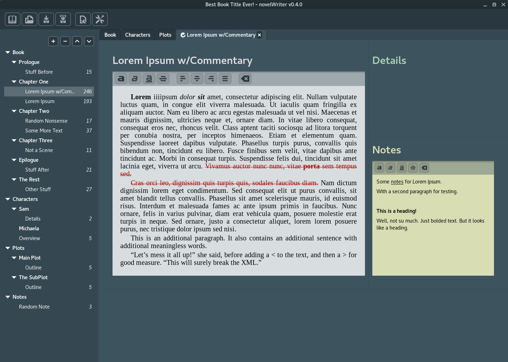

# novelWriter

**On master branch: Development for version 0.4**

Latest pre-release: [Version 0.3](https://github.com/vkbo/novelWriter/releases/tag/v0.3)
(Version 0.4 will not be compatible with 0.3 project files.)

**NB: Major rewrite in progress!**

I am currently rewriting the entire project more or less from scratch using a different approach.
I wasn't happy with using WebKit as the core text editor, and will be using Gtk.TextView instead.

*The code is still under initial development*

## Description

A simple editor for writing books by providing a simple editor with basic formatting.
Centred around writing the the book scene by scene.

The idea is to have an application that has a relatively distraction free interface, but enough
tools so that it is possible to organise the scenes, plots and characters of a novel in a way
that assists writing just enough.

I have tested a number of tools already, and found none that suits my needs, FocusWriter is great,
but too minimal. yWrite is also excellent, but far too much. This one aims to sit somewhere in
between.

As a programmer, I have used a layout that resembles simple code editors like Geany. All the files
are organised in a treeview on the left, and the files can be opened and edited as individual tabs.
As opposed to a code editor, I use wide margins, colours, and a flat layout. The application is
designed to be styleable through a css stylesheet in the themes folder.

**Built on:**

Python3 and Gtk3. Currently GtkSource is used as well as it adds undo/redo to the Gtk.TextView. I
will most likely write my own at some point, but it is not a high priority. GtkSource only lets
you undo/redo actual text, and does not record formatting like bold, italics, etc.

Files are stored as XML, using the lxml package.

## Running noverlWriter

### Linux

Runs with latest Python 3. Works for at least 3.4 and up. Requirements:

* PyGObjects with Gtk 3.20+, GtkSource 3.0+
* Requires the following Python packages
  * configparser
  * appdirs
  * lxml
  * unidecode (may not be needed any more, must check)

### Windows (only tested with Win7)

Currently does not work properly on Windows as some features from Gtk 3.20 is needed. Windows port
of PyGObjects is currently only at [version 3.18](https://sourceforge.net/projects/pygobjectwin32/).

The lacking support is for calling native file system dialoges (file open/save). Otherwise
novelWriter works with Python 3.4, and requires the following packages installed via `pip`:

  * appdirs
  * lxml

## Features

Currently implemented features or actively being implemented (some are incomplete):

* Four main groups of documents:
  * Book: Holds chapters and scenes files.
  * Characters: Holds a folder for each character, with any number of note files.
  * Plots: Holds a folder for each plot, with any number of note files.
  * Notes: A last folder where other note files can be kept.
* Each scene file under book or chapter also has a box for note taking.
* Files are organised into a project file, and a folder with the same name containing one file
  per document. These are all XML files with file extension `.nwx`.
* The application is themeable through stylesheets in the themes folder.

Features being added before 0.4 release:

* Timeline pane on the bottom of the screen where each chapter and scene appear as a column, and
  each character and plot appears as a row. These can be connected with marks to show which scenes
  are linked to which plots and characters.
* Spellchecking with GtkSpell.

## Screenshots

The book page of the example project

Editing a scene file
